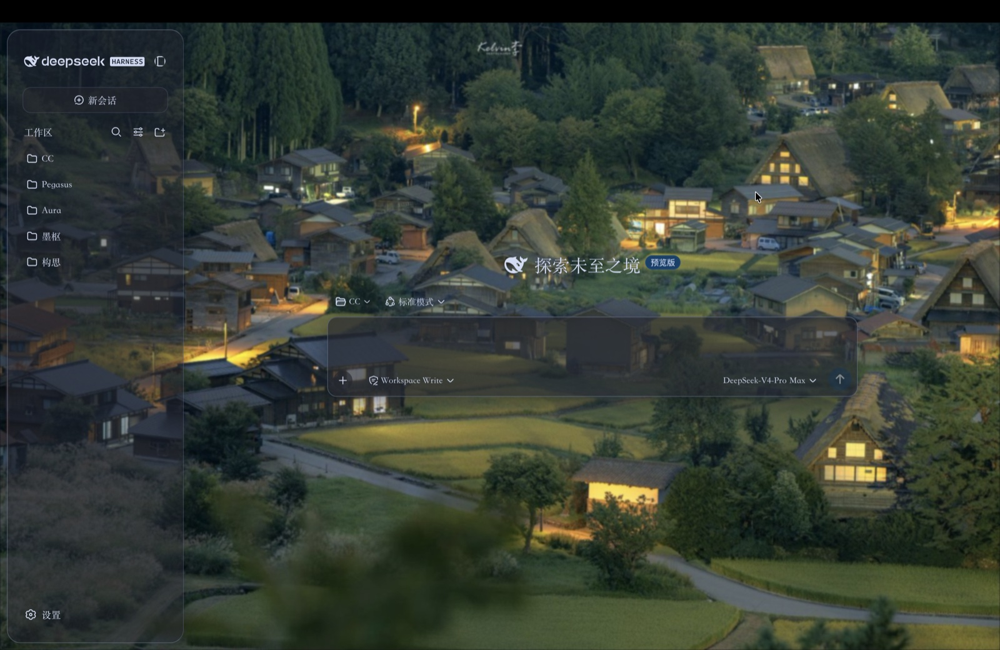
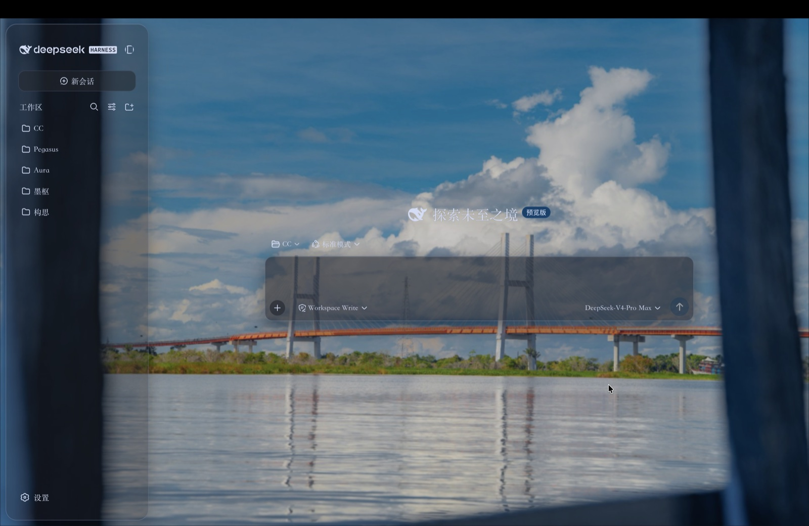
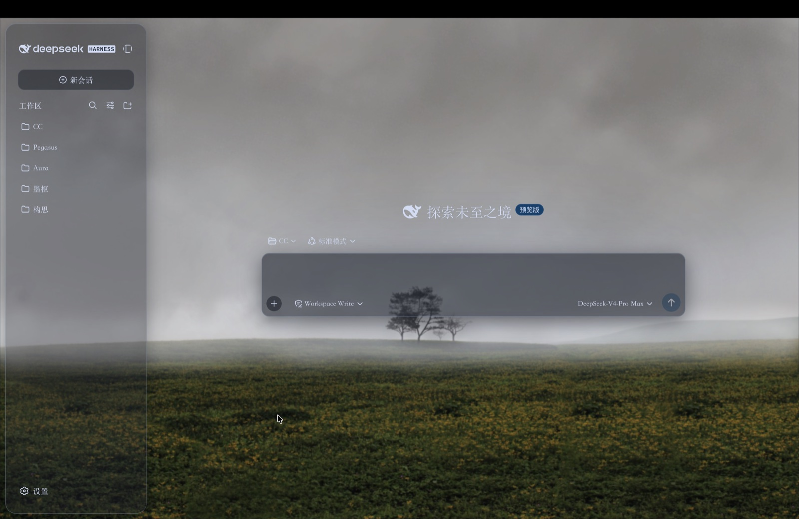
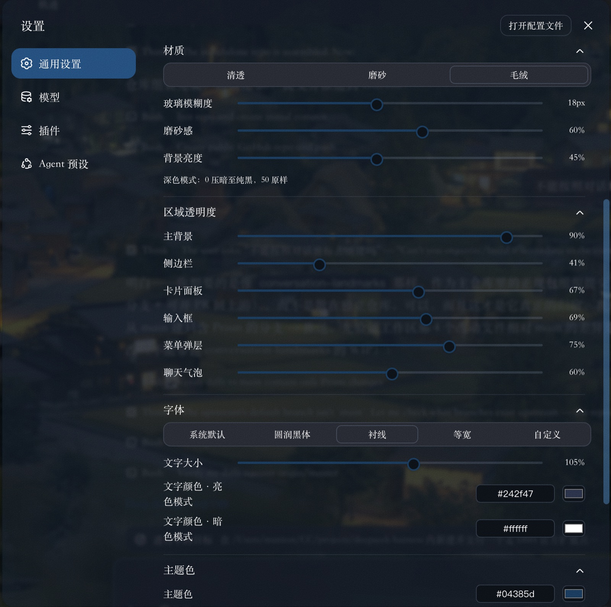
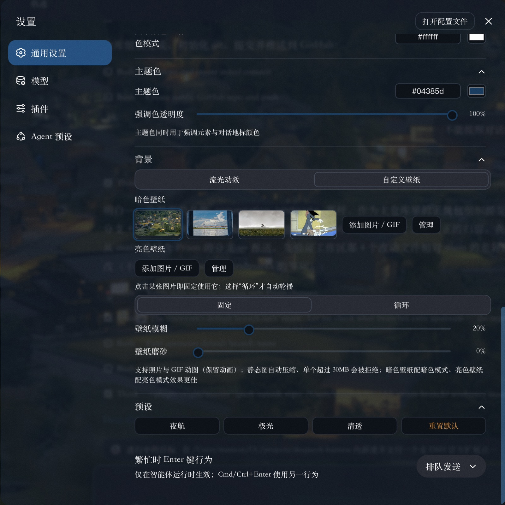

# Prism · 棱镜 — DSH 毛玻璃主题插件

`@deepseek-ai/dsh-client-ui-prism` 的独立发行版，面向 [DeepSeek Harness](https://github.com/deepseek-ai/deepseek-harness) Web GUI。仓库自带预构建产物（`lib/`），安装者无需任何构建。

## 安装

需要一个启用 web profile 的 DeepSeek Harness，从 GitHub 源码安装：

```sh
dsh plugin --profile web add github:mantonlove/dsh-prism-plugin
```

重启 `dsh web`、刷新页面，然后在 设置 → 插件 找到「棱镜」总开关卡片；全部旋钮在 设置 → 通用设置 → 外观 下方（分组默认折叠，点击标题展开）。

卸载：

```sh
dsh plugin --profile web remove dsh-client-ui-prism
```

## 特性

- 毛玻璃材质（清透 / 磨砂 / 毛绒）、模糊、全局磨砂感、六区独立透明度（主背景 / 侧边栏 / 卡片面板 / 输入框 / 菜单弹层 / 聊天气泡）
- 全范围颜色控件（Codex 风格）：色号输入 + 点击取色——主题色（同时驱动强调元素与对话地标）、背景主色调、明暗双模式文字颜色
- 弹簧阻尼滑轨、文字大小与字体、流光动效背景、明暗分槽的图片/GIF 多图轮播（固定/循环 + 管理模式）
- 总开关一键还原原生界面；设置持久化于 localStorage 并跨标签页同步

---
## 效果展示

| | | |
|---|---|---|
|  |  |  |
|  |  | |


[English](README.md) | 中文

Prism（棱镜）：DSH Web GUI 的毛玻璃主题层。模糊、磨砂、六区透明度、文字大小与字体、强调色与背景主色调、对比度、动效强度、照片/GIF 壁纸——全部实时可调，且每条滑轨都带**弹簧阻尼手感**（皮肤平滑"滑"向目标值，而不是硬跳）。整层走官方扩展点（`ctx.theme.overrideTokens` 主题覆盖栈 + settings slot 系统）；关闭总开关（或卸载插件）即完全还原原生界面。

## 调节项

| 分组 | 旋钮 | 范围 | 说明 |
|---|---|---|---|
| 玻璃材质 | 材质档位 | 清透 / 磨砂 | 模糊 + 饱和度配方（磨砂 = 18px 模糊 + 130% 饱和度） |
| 玻璃材质 | 玻璃模糊度 | 0–40 px | `backdrop-filter: blur() saturate()` |
| 玻璃材质 | 磨砂感 | 0–100 | 所有玻璃面的全局透明度乘数 |
| 区域透明度 | 六区滑杆 | 20–90 % | 主背景 / 侧边栏 / 卡片面板 / 输入框 / 菜单弹层 / 聊天气泡，各自独立 |
| 背景 | 背景亮度 | 0–100 | 50 原样；深色模式压暗、浅色模式提亮 |
| 背景 | 背景主色调 | 0–360 | 驱动流光动效的配色 |
| 背景 | 动效强度 | 0–100 | 缩放动画速度与光斑强度；0 = 静止 |
| 文字 | 文字大小 | 85–120 % | 通过 calc() 缩放全部 30 个 `--dsw-font-*` 复合 token |
| 文字 | 字体 | 系统默认 / 圆润黑体 / 衬线 / 等宽 / 自定义 | 界面与代码字体栈；自定义可填任意字体名 |
| 颜色 | 强调色 | 0–360 | 派生品牌色、按钮、滚动条、选区、焦点环 |
| 颜色 | 对比度 | 0–100 | 缩放次级文字与边框强度 |
| 背景来源 | 流光动效 / 自定义壁纸 | — | 流光为纯 CSS 实现（不依赖 GPU/WebGL）；壁纸支持照片与 GIF 动图 |
| 壁纸 | 暗色壁纸 / 亮色壁纸 | 分槽独立 | 静态图自动压缩（≤1920px、JPEG），GIF 原样保留动画，超过 12MB 拒绝 |
| 壁纸 | 壁纸模糊 / 壁纸磨砂 | 0–40 px / 0–100 | 另含按实测图片亮度自动计算的压暗蒙版 |
| 预设 | 夜航 / 极光 / 清透 / 重置默认 | — | 一键旋钮组合 |

## 设计

- **静态 token 层**：派生引擎把强调色相、对比度、磨砂感与六区透明度一次性展开成整套 `--dsw-alias-*` / `--dsw-specific-*` 调色板；所有动态部分都是 `var(--prism-*)` 引用，因此调旋钮只是往 `<html>` 写一个 CSS 变量，token 层在调节过程中**永不重挂**。
- **阻尼旋钮**：每个数值旋钮是一个临界阻尼弹簧（半隐式欧拉、固定子步长），共用一个 rAF 循环推进。系统开启"减弱动效"时弹簧瞬时到位。
- **零残留**：CSS 全部挂在 `html[data-dsh-prism]` 属性下；流光、壁纸、亮度层随层挂载/移除；token 覆盖返回 disposer。
- **可读性护栏**：按实测亮度自动压暗壁纸、亮度随明暗定向、对比度缩放文字灰度、玻璃面上 1px 文字光晕。

## 设置入口

- `settings.plugin.item`（id `prism`，order 6）：设置 → 插件 里的总开关卡片。
- `settings.general.item`（id `prism`，order 12）：设置 → 通用设置 → 外观 正下方的全部旋钮。

设置持久化在 `localStorage` 的 `dsh.ui-prism.settings.v1`，并通过 storage 事件跨标签页同步。

## Model Experience

None, as this plugin only overrides browser presentation tokens, mounts visual layers, and registers settings controls; nothing here reaches a model request.

#### KV Cache effect

None; this package neither assembles nor sends a provider request.

## Known Limitations and Deferred Work

- **token 体系之外的写死字号** — 文字大小旋钮缩放全部 `--dsw-font-*` 复合 token；极少数组件样式里的字面 px 字号不跟随缩放。
- **GIF 无法暂停** — CSS 停不住 GIF 内部动画，因此在"减弱动效"下直接隐藏壁纸层，而不是冻结。
- **backdrop-filter 开销** — 模糊上限 40px；低端 GPU 在高模糊度 + 高磨砂度下可能掉帧。
- **localStorage 配额** — 壁纸以 data URL 持久化；超大 GIF 可能耗尽配额（上传已限 12MB，静态图自动压缩）。
